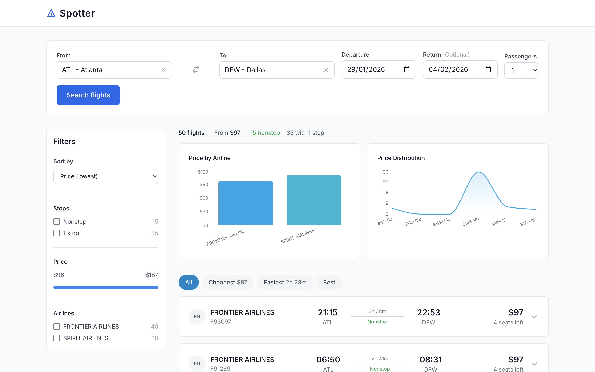

# Spotter - Flight Search Engine

A modern flight search application built with React, TypeScript, and the Amadeus API.

**Live Demo:** [https://spotter-wine.vercel.app](https://spotter-wine.vercel.app)



## Features

### Core
- **Flight Search** - Search flights by origin, destination, dates, and passengers
- **Real-time Results** - Powered by Amadeus Flight Offers Search API
- **Smart Filtering** - Filter by stops, price range, and airlines
- **Price Chart** - Visualize prices by airline
- **Responsive Design** - Optimized for desktop and mobile devices

### Extra
- **Sorting** - Sort by price, duration, departure, or arrival time
- **Quick Filters** - One-click tabs for Cheapest, Fastest, and Best flights
- **Price Distribution Chart** - Area chart showing flight count by price range
- **Search History** - Recent searches saved in localStorage for quick access

## Tech Stack

- **Frontend:** React 18, TypeScript, Vite
- **Styling:** Tailwind CSS
- **Charts:** Recharts
- **API:** Amadeus Flight Offers Search API
- **Deployment:** Vercel

## Getting Started

### Prerequisites

- Node.js 18+
- Amadeus API credentials ([Sign up here](https://developers.amadeus.com))

### Installation

1. Clone the repository
   ```bash
   git clone https://github.com/kinu01/spotter.git
   cd spotter
   ```

2. Install dependencies
   ```bash
   npm install
   ```

3. Create environment variables

   For local development, create a `.env` file:
   ```env
   AMADEUS_CLIENT_ID=your_client_id
   AMADEUS_CLIENT_SECRET=your_client_secret
   ```

   For Vercel deployment, add these as environment variables in your project settings.

4. Start the development server
   ```bash
   npm run dev
   ```

5. Open [http://localhost:5173](http://localhost:5173)

## Project Structure

```
src/
├── main.tsx                    # Application entry point
├── App.tsx                     # Root component with routing
├── index.css                   # Global styles (Tailwind)
│
├── features/                   # Feature-based modules (self-contained)
│   │
│   ├── search/                 # Search feature
│   │   ├── components/         # SearchForm, AirportPicker, DateInput, SearchHistory
│   │   ├── hooks/              # useFlightSearch, useSearchHistory
│   │   ├── services/           # API calls (flightService)
│   │   └── index.ts            # Public exports
│   │
│   ├── flights/                # Flight results feature
│   │   ├── components/         # FlightCard, FlightList, FlightSummary
│   │   ├── utils/              # Data transformation
│   │   └── index.ts
│   │
│   ├── filters/                # Filtering & sorting feature
│   │   ├── components/         # FilterPanel, StopsFilter, PriceSlider, QuickFilterTabs
│   │   ├── hooks/              # useFlightFilters
│   │   ├── utils/              # Filter logic
│   │   └── index.ts
│   │
│   └── charts/                 # Data visualization feature
│       ├── components/         # PriceChart, PriceDistributionChart
│       ├── utils/              # Chart data aggregation
│       └── index.ts
│
├── pages/                      # Page components (route entry points)
│   └── SearchPage.tsx          # Main search page
│
└── shared/                     # Shared across all features
    ├── components/             # Reusable UI (Button, Layout, Icons, Skeleton)
    ├── hooks/                  # Shared hooks (useBreakpoint)
    ├── types/                  # TypeScript interfaces
    └── utils/                  # Helper functions (format, etc.)
```

## Scripts

| Command | Description |
|---------|-------------|
| `npm run dev` | Start development server |
| `npm run build` | Build for production |
| `npm run preview` | Preview production build |
| `npm run lint` | Run ESLint |
| `npm test` | Run tests in watch mode |
| `npm run test:run` | Run tests once |

## API

The app uses [Amadeus Flight Offers Search API](https://developers.amadeus.com/self-service/category/flights/api-doc/flight-offers-search) to fetch real flight data. The API is called through a serverless function (`/api/flights.ts`) to keep credentials secure.

## License

MIT
